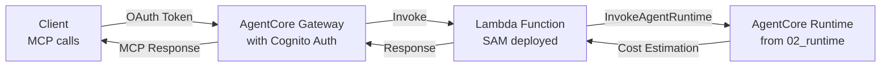

# 03_gateway - AgentCore Gateway with Lambda Integration

This example demonstrates how to combine AWS Lambda with Amazon Bedrock AgentCore Gateway to expose the cost estimator agent from `02_runtime` as an MCP tool.

## Overview

In this example, we:
1. Deploy a Lambda function using AWS SAM that calls the AgentCore Runtime from `02_runtime`
2. Create an AgentCore Gateway with Cognito authentication
3. Add the Lambda function as a Gateway target with the `aws_cost_estimation` tool
4. Test the Gateway using MCP protocol

## Architecture



## Prerequisites

- AWS CLI configured with appropriate permissions
- AWS SAM CLI installed
- Python 3.12 or later
- Completed deployment of AgentCore Runtime in `02_runtime`
- Docker (for SAM build)

## Files

- `template.yaml` - AWS SAM template for Lambda deployment
- `src/app.py` - Lambda function that calls AgentCore Runtime
- `src/requirements.txt` - Lambda dependencies
- `deploy.sh` - Script to deploy Lambda using SAM
- `create_gateway.py` - Script to create Gateway with Cognito OAuth
- `test_gateway.py` - Script to test the Gateway
- `requirements.txt` - Local Python dependencies

## Setup Instructions

### Step 1: Install Dependencies

```bash
pip install -r requirements.txt
```

### Step 2: Deploy the Lambda Function

The deployment script automatically reads the AgentCore Runtime ARN from `02_runtime/.bedrock_agentcore.yaml`:

```bash
./deploy.sh
```

This will:
- Build the Lambda function using SAM
- Deploy it to AWS with the AgentCore Runtime ARN as a parameter
- Output the Lambda function ARN

### Step 3: Create the Gateway

```bash
python create_gateway.py
```

This will:
- Create a Cognito user pool for OAuth authentication
- Create an AgentCore Gateway with the Cognito authorizer
- Add the Lambda function as a target with the `aws_cost_estimation` tool
- Save the configuration to `gateway_config.json`

### Step 4: Test the Gateway

```bash
python test_gateway.py
```

This will:
- Obtain an OAuth token from Cognito
- List available tools from the Gateway
- Call the `aws_cost_estimation` tool with sample architecture descriptions
- Display the cost estimation results

## How It Works

### Lambda Function (`src/app.py`)

The Lambda function:
1. Receives tool invocations from the Gateway
2. Extracts the tool name and parameters
3. Calls the AgentCore Runtime deployed in `02_runtime`
4. Streams the response back to the Gateway

Key features:
- Simple implementation focused on the `aws_cost_estimation` tool
- Proper error handling and logging
- Automatic session management

### Gateway Creation (`create_gateway.py`)

Uses the AgentCore SDK to simplify Gateway setup:
- `create_oauth_authorizer_with_cognito()` - Automatically sets up Cognito
- `create_mcp_gateway()` - Creates the Gateway with minimal configuration
- `create_mcp_gateway_target()` - Adds the Lambda target with tool schema

### Testing (`test_gateway.py`)

Demonstrates two ways to interact with the Gateway:
1. Direct MCP API calls using HTTP requests
2. MCP client SDK (if available)

## Example Output

```bash
$ python test_gateway.py

2024-01-15 10:30:00 - __main__ - INFO - Gateway URL: https://abc123.gateway.us-east-1.amazonaws.com/mcp
2024-01-15 10:30:01 - __main__ - INFO - Successfully obtained OAuth token

Test 1: Direct API calls
========================
2024-01-15 10:30:02 - __main__ - INFO - Tools response: {
  "jsonrpc": "2.0",
  "id": 1,
  "result": {
    "tools": [
      {
        "name": "aws_cost_estimation",
        "description": "Estimate AWS costs for a given architecture description",
        "inputSchema": {
          "type": "object",
          "properties": {
            "architecture_description": {
              "type": "string",
              "description": "Description of the AWS architecture to estimate costs for"
            }
          },
          "required": ["architecture_description"]
        }
      }
    ]
  }
}

2024-01-15 10:30:03 - __main__ - INFO - Tool response: {
  "jsonrpc": "2.0",
  "id": 2,
  "result": {
    "content": [
      {
        "type": "text",
        "text": "## AWS Cost Estimation\n\nBased on your serverless architecture:\n\n### Monthly Cost Breakdown:\n- Lambda: $20.00 (1M requests)\n- API Gateway: $3.50\n- DynamoDB: $25.00 (on-demand)\n- S3: $5.00 (storage)\n\n**Total Estimated Monthly Cost: $53.50**"
      }
    ]
  }
}
```

## Troubleshooting

### Lambda Deployment Issues

If SAM deployment fails:
1. Ensure Docker is running (required for SAM build)
2. Check AWS credentials and permissions
3. Verify the AgentCore Runtime is deployed in `02_runtime`

### Gateway Creation Issues

If Gateway creation fails:
1. Check IAM permissions for creating Cognito and AgentCore resources
2. Ensure the Lambda function was deployed successfully
3. Check AWS service limits in your region

### Testing Issues

If testing fails:
1. Wait a few minutes after Gateway creation for DNS propagation
2. Check the OAuth token is being obtained successfully
3. Verify the Lambda function has permissions to invoke AgentCore Runtime

## Clean Up

To avoid ongoing charges:

1. Delete the CloudFormation stack:
```bash
aws cloudformation delete-stack --stack-name agentcore-gateway-lambda
```

2. Delete the Gateway (this will also delete targets):
```bash
# Get gateway ID from gateway_config.json
GATEWAY_ID=$(cat gateway_config.json | jq -r '.gateway_id')
aws bedrock-agentcore-control delete-gateway --gateway-identifier $GATEWAY_ID
```

3. Delete Cognito resources (optional, as they have no ongoing cost)

## Next Steps

- Modify the Lambda function to add more tools
- Integrate the Gateway with your agent framework
- Add custom authentication or request transformation
- Explore other Gateway target types (REST API, etc.)

## Key Learnings

1. **Simple Integration**: AgentCore SDK simplifies Gateway creation with automatic Cognito setup
2. **Lambda Bridge**: Lambda functions can easily bridge between Gateway and AgentCore Runtime
3. **Tool Schema**: Proper tool schema definition enables seamless MCP integration
4. **OAuth Flow**: Cognito provides secure authentication for Gateway access