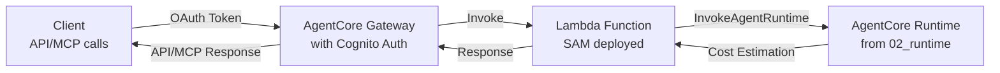

# 03_gateway - AgentCore Gateway with Lambda Integration

This example demonstrates how to combine AWS Lambda with Amazon Bedrock AgentCore Gateway to expose the cost estimator agent from `02_runtime` as an MCP tool.

## Overview

In this example, we:
1. Deploy a Lambda function using AWS SAM that calls the AgentCore Runtime from `02_runtime`
2. Create an AgentCore Gateway with Cognito authentication
3. Add the Lambda function as a Gateway target with the `aws_cost_estimation` tool
4. Test the Gateway using both direct API calls and MCP protocol

## Architecture



## Prerequisites

- AWS CLI configured with appropriate permissions
- AWS SAM CLI installed
- Python 3.12 or later
- Completed deployment of AgentCore Runtime in `02_runtime`
- Docker (for SAM build)

## Files

- `template.yaml` - AWS SAM template for Lambda deployment
- `src/app.py` - Lambda function that calls AgentCore Runtime
- `src/requirements.txt` - Lambda dependencies
- `deploy.sh` - Script to deploy Lambda using SAM
- `create_gateway.py` - Script to create Gateway with Cognito OAuth
- `test_gateway.py` - Script to test the Gateway with API and MCP methods
- `test_lambda_simple.py` - Simple Lambda function test without Docker

## Detailed Setup Instructions

### Prerequisites Installation

Install local dependencies:

```bash
uv sync
```

Ensure you have completed the `02_runtime` deployment:

```bash
ls ../02_runtime/.bedrock_agentcore.yaml
```

This file should exist and contain the AgentCore Runtime ARN.

### Step-by-Step Execution

#### 1. Deploy Lambda Function (`deploy.sh`)

The deployment script reads the AgentCore Runtime ARN and deploys the Lambda function:

```bash
./deploy.sh
```

**What it does:**
- Extracts `agent_arn` from `../02_runtime/.bedrock_agentcore.yaml`
- Builds the Lambda function using `sam build`
- Deploys using `sam deploy` with the runtime ARN as a parameter
- Saves the deployed Lambda function ARN and deployment info to `gateway_config.json`

**Expected output:**
```
Building Lambda function...
Deploying Lambda function...
Lambda function deployed successfully!
Lambda Function ARN: arn:aws:lambda:us-east-1:123456789012:function:AgentCoreLambdaFunction-ABC123
Configuration saved to gateway_config.json
```

#### 2. Create Gateway (`create_gateway.py`)

Creates the AgentCore Gateway with Cognito authentication:

```bash
# Auto-detect Lambda ARN from gateway_config.json
uv run create_gateway.py

# Or specify Lambda ARN explicitly
uv run create_gateway.py --lambda-arn arn:aws:lambda:region:account:function:name

# Force recreation of all resources
uv run create_gateway.py --force
```

**Command line options:**
- `--lambda-arn ARN`: Specify Lambda function ARN explicitly (auto-detected if not provided)
- `--force`: Force recreation of resources even if they already exist

**What it does:**
- Reads Lambda function ARN from `gateway_config.json` or uses provided ARN
- Creates Cognito user pool and OAuth configuration
- Creates AgentCore Gateway with Cognito authorizer
- Adds Lambda function as a target with `aws_cost_estimation` tool
- Saves complete configuration to `gateway_config.json`

**Expected output:**
```
INFO: Starting AgentCore Gateway setup...
INFO: Using Lambda ARN: arn:aws:lambda:us-east-1:123456789012:function:name
INFO: Creating Cognito user pool...
INFO: Creating AgentCore Gateway...
INFO: Adding Lambda target to Gateway...
INFO: Gateway created successfully!
INFO: Gateway URL: https://abc123.gateway.us-east-1.amazonaws.com/mcp
INFO: Configuration saved to gateway_config.json
```

#### 3. Test Gateway (`test_gateway.py`)

Tests the complete Gateway integration:

```bash
# Test using direct API calls (default)
uv run test_gateway.py

# Test using MCP protocol via Strands
uv run test_gateway.py --tests mcp

# Test using direct API calls explicitly
uv run test_gateway.py --tests api
```

**Command line options:**
- `--tests {api,mcp}`: Type of test to run (default: api)
  - `api`: Direct API calls to the Gateway
  - `mcp`: MCP client via Strands framework

**What it does:**
- Reads gateway configuration from `gateway_config.json`
- Obtains OAuth token from Cognito
- Tests the Gateway using either direct API calls or MCP protocol
- Calls `aws_cost_estimation` tool with sample architecture descriptions
- Displays cost estimation results

**Expected output for API test:**
```
INFO: Gateway URL: https://abc123.gateway.us-east-1.amazonaws.com/mcp
INFO: Successfully obtained OAuth token

=== Testing Gateway with Direct API Calls ===
Available tools: ['aws_cost_estimation']

Cost estimation result:
## AWS Cost Estimation

Based on your serverless architecture:

### Monthly Cost Breakdown:
- Lambda: $20.00 (1M requests)
- API Gateway: $3.50
- DynamoDB: $25.00 (on-demand)
- S3: $5.00 (storage)

**Total Estimated Monthly Cost: $53.50**
```

#### 4. Simple Lambda Test (`test_lambda_simple.py`)

Test the Lambda function logic directly without Docker:

```bash
uv run test_lambda_simple.py
```

**What it does:**
- Tests the Lambda function logic directly without Gateway context
- Simulates the AgentCore Gateway metadata in the Lambda context
- Useful for debugging Lambda function issues independently
